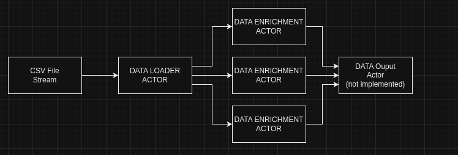

### https://github.com/H15Z/gptsummary ###

### Summary ###

This POC project specifically created to demonstrates the following concepts:

* Project structure with dependency injection and avoiding coupling
* Custom Actor Model of Concurrency implementation
* High data throughput to allow for processing and enriching data at scale
* Leveraging Chat GPT API to enrich data/transform data
* Fan-Out Fan-In concurrency pattern implemented using Actor Model

### How it Works! ###

Data is streamed in from a CSV file (alternative data sources could be used such as DB, storge buckets, webscraping etc..). The Articles in the CSV file are then used to generate a Chat GPT prompt. OPEN AI API is used to get responses from Chat GPT and data is enriched with a summary, sentiment and category. Final Actor is not implemented but could write data to database etc.




Example output:

```
=======================
Title: Mental Note Vol. 24
Summary: Appreciation for readers and writers in destigmatizing mental illness, top stories from last week, personal reflections on loss, self-compassion, and the impact of the pandemic on mental health.
Sentiment: positive
Category: Media
=======================
Title: Mind Your Nose
Summary: Smell training can strengthen neural pathways and increase brain plasticity. Ongoing regeneration of olfactory neurons in the nose allows us to detect smells throughout our lives. Intense olfactory training for six weeks leads to structural changes in the brain.
Sentiment: positive
Category: Health & Wellness
=======================
Title: Your Brain On Coronavirus
Summary: The impact of the coronavirus pandemic and isolation on the brain includes blood clotting, stroke, and worsening mental health. Long-haulers continue to experience symptoms months later.
Sentiment: neutral
Category: Health
=======================

```

### Limitations ###

Hacked together over a Sunday hence far from ideal:

* Test coverage could be significantly better
* Many shortcuts taken i.e. `TODO` comments explaining how code could be improved
* Missing CI/CD
* Timeouts and better error handling needed
* Need an output Actor to log output nicely (ie in order when many threads are used)


## INSTALLATION ##

1. Download and extract to `data/` folder:

https://www.kaggle.com/datasets/fabiochiusano/medium-articles

2. Get an API key from OPEN AI:

https://platform.openai.com/account/api-keys

create a `.cmd.yml` file and update with Open AI  API key

3. Build Binary

```console 
go mod tidy
go build

```

## STREAMING DATA ENRICHMENT ##

c - limit number of articles to stream (150k total)

t - numer of enrichment actors to initialize (threads) - keep this low not to hit API Rate limits

```console

./gptsummary stream -c 3 -t 3

```

## DOCKER ##

Incase you dont have Golang installed the application can be ran using docker:

```console
docker build -t gptsummary .

docker run -it --rm gptsummary
```